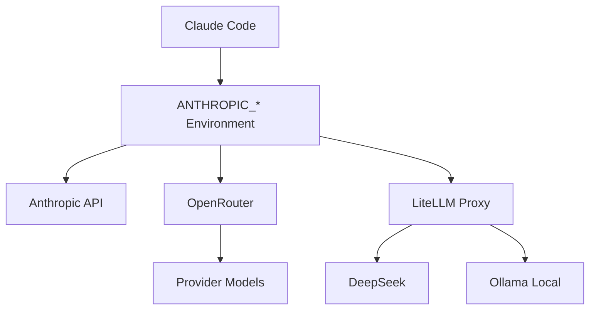

# Model Routing Workbench

## How to Read This Diagram

This diagram is the shortest path through the repository's operating model. It is intentionally focused on control flow rather than implementation detail. The public package should make the safe path obvious first: local fixtures, explicit validation, human approval where external side effects exist, and post-task telemetry after every meaningful change.

## Safety Boundary

Any edge that would connect to a real external system must be treated as disabled, stubbed, or approval-gated in public examples. Real credentials, private URLs, live workflows, production logs, and account-specific values are outside the public boundary.

## Validation Boundary

A contributor should be able to map every major box in the diagram to a doc, example, fixture, or validation checklist in this repo. If a box cannot be explained or validated from public files, it should remain a roadmap item rather than a public claim.

